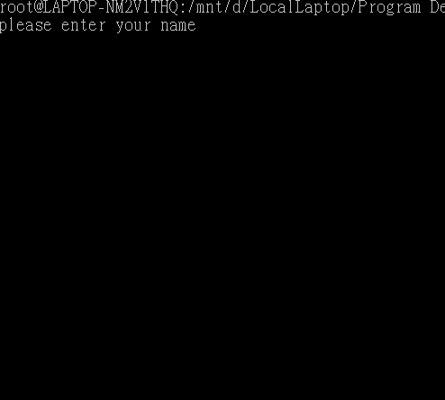

# A Monster Shooting Game 
# (along with POSTFIX)

## Final project of C++ programming, NCTU ECE, 2016 Fall.

####  Project Site: https://github.com/YCHuang2112/JAVA-Music-Game
----

#### Credited to (the 14th group members): 
		Yu-Cheng Huang (Game interface, logic, and integration), 

		林以鑫 (Program Structure Design),
 
		高璿哲 (Game Classes Design).

-----

## prerequisite:
	Linux environment

	g++ compiler

## To Compile & Run:
	Open Terminal and go to directory: Shooting-Game Main Program

	Then, executing following commands:
		(optional) rm start  
		(optional) rm score_board.txt
		g++ -o start main.cpp
	
	Finally, type ./start to enjoy your game
	
	use direction key to move, space to shoot;
	return key can halt/exit the game.
	ctrl+s starts/continues the game.
	
## Game Operation and Logic:
	symbol p: player
	symbol I: monsters
	symbol o: bullets
	symbol x around p: activated traps
	

	Direction Key: controls player movement
	Space Key:     shoot bullets 
	
	player shoot monsters, while monsters can "Bonk"/attack and bounce player back.
	traps can freeze player for few seconds.
	Once the player HP becomes zero, the game ends.
	If the number of killed monsters reaches requirement, player advanced to next stage.
	
	There're infite stages of the game.  Further you go, so do numbers of monsters increase 
	accompanied by the increment of player HP, numbers of bullets and traps.

## Game Screen:

	
<!--  -->

## User Settings:
	See file: parameters.h
	*To activate new settings, please recompile the whole project.
	
## Scoreboard:
	See file: Score_board.txt
	

	
	

